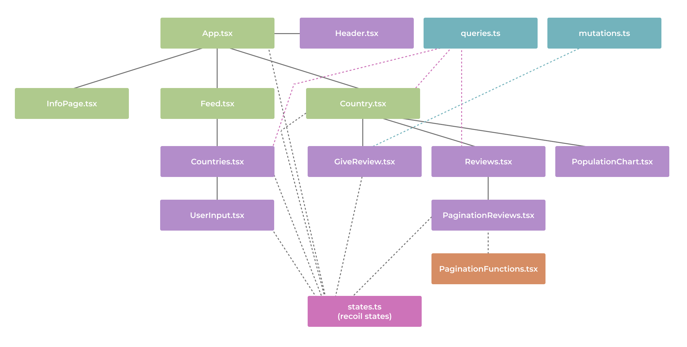

# ✈️🌍 Project 4 - Envisionary
Welcome to our project, Envisionary. Envisionary allows the user to make informed choices about their next travel destination through viewing information and reviews from other travellers about the world’s countries. The users of Envisionary are encouraged to write their own reviews on countries they have visited. For ease of use, Envisionary’s data can be filtered in several ways; both by searching for countries and continents and by hiding unreviewed countries. The countries can also be sorted from A-Z or Z-A on both countries and continents.

Our project is powered by MongoDB, Apollo, TypeScript React and Node.js. Because our Apollo server also uses Express under the hood, our project ends up with a *MERN* stack. Additionally, we have used Mongoose, the component library Material UI, recharts for charts, recoil for global state management and React Router DOM for routing between pages in a SPA-friendly way. For querying the database, we used GraphQL. Lastly, we have tested with Jest, React Testing Library and Cypress.
  

## 🎉 Running the project
The project can be viewed and tested live at http://it2810-66.idi.ntnu.no/project3/. However, to run locally do the following:

1. Clone project
2. Open a terminal window, navigate to the backend folder and run `npm install` followed by `npm start`
3. In another terminal window, navigate to the frontend folder, then run `npm install` followed by `npm start`

Please do not hesitate to contact a team member if you have problems running the project. We are here for you.
  

## 👨‍🏫 Running the tests

### Run unit tests:
1. Open a terminal window, navigate to the frontend folder and run `npm test a`
 

### Run end-to-end (E2E) tests:
1. Run the project as described in [this section](#🎉-running-the-project)
2. Open a terminal window, navigate to the frontend folder and run `npm run cypress:open`. This will open Cypress. 
3. When Cypress has opened, click on "E2E Testing". And click "Start E2E Testing in Firefox" or "Start E2E Testing in Chrome". 
4. There are two E2E tests: "countries.spec.cy.ts" and "review.spec.cy.ts". Simply click one to make the test run. 
  

## ✨What is new?
For project 4 we chose task b: "Forbedringer og systematisk enhetstesting av backend og klient fra prosjekt 3" as testing was the main area we wanted to improve in our project. 

In addition, we decided to implement some of the suggestions we received from peer reviews for project 3 and other changes that we wanted to do. These additional changes are related to sustainability and accessibility. 
  

### 🧪Testing
**Test coverage**  
For project 4, we aimed to raise our test coverage to approximately 80%. By the end of project 4, we had achieved a test coverage of 86%.

To view our project's test coverage follow these steps:
1. Run the project as described in [this section](#🎉-running-the-project)
2. Open a terminal window, navigate to the frontend folder and run `npm test -- --coverage --watchAll`
  

**Mocking**  
Mocking is used when we want to replace a dependency in a test with a mock, a stand-in for that dependency. In our case, we chose to mock the Apollo Client, React Router DOM and Rechart's *ResponsiveContainer* used in the population chart. This has allowed us to "isolate" the code we want to test. This was one major challenge that prevented us from making satisfactory tests in the previous project, as we didn’t know how to mock properly. We have made many mocks for different purposes, some for edge cases, for example for testing error handling when data can’t be queried from the database, or when the next page contains no reviews. Mocking also allows us to have predictable queries and states for our components, making it possible to test specific scenarios. Furthermore, it prevents unnecessary load on our backend/database and the internet infrastructure in general.  

**Snapshot tests**  
Snapshot testing is used to take a screenshot of the user interface and compares the current user interface with the stored screenshot. We had previously only two snapshot tests for the Countries and UserInput components. We have now added snapshot tests for the Country, GiveReview, InfoPage, PopulationChart and Reviews components. This will therefore render the different components and check that the user interface is correct.
  

**Unit tests**  
Unit tests are good for testing functionality that cannot be tested without simple rendering. The React Testing Library is made for testing the application in a way that resembles the way it is used (source [here](https://testing-library.com/docs/react-testing-library/intro/)). This includes, but is not limited to, ensuring that components behave correctly when buttons are clicked on, text is typed in text fields, or values are picked from dropdown menus. We used the user-event companion library to interact with components. This provides the browser simulation that we need to trigger events like clicking or typing, which should change the component in ways that can be verified using the expect-method (source [here](https://testing-library.com/docs/ecosystem-user-event/)). Used in conjunction with the mocks mentioned earlier, we rendered components with the desired states which were then interacted with. For example, when checking validation in the GiveReview component, we used mocks for querying countries “from the backend” and for mutation when successfully submitting. We already had unit tests for Countries and UserInput, but they were very limited. In this project, we have made tests for Country, GiveReview, InfoPage, PopulationChart and Reviews, and greatly improved those we had from project 3.
  

**E2E testing**  
E2E tests are good for testing real user scenarios. Because unit tests usually are limited to testing individual units, we have E2E tests for testing scenarios that make use of multiple components. These test the application as a real user would.  We already had two E2E tests from project 3. Because of some functionality changes done to make the app more sustainable, we had to rewrite one of these tests, namely the test for reviewing a country (see review.spec.cy.ts). Also, countries.spec.cy.ts was inconsistent and sometimes failed on some PCs and browsers due to the way empty spaces are encoded and language settings. We fixed this issue and added one more test in countries.spec.cy.ts.
  

### 💡💚 Sustainable web design
**Colours and sustainability** 
In the previous project, the overall design theme on our site was quite bright and light, which consumes more energy than a dark design theme. To ensure that the site is more sustainable we decided to implement a toggle switch between dark and light themes, which allows the user to pick their preferred design theme. The default theme is dark. In addition, many find a dark theme to be more comfortable as it can reduce eye strain after long days of looking at a screen. We used Context API to create the variables that determine whether the theme is dark or light.
  

**Movements in the website** 
Also, in project 3, we had animations for each population graph when the user clicked on a country and some interaction when the user hovered over the graph points. The graphs are still interactive in project 4, but there is no animation on the graph when you enter the “Country”-page. The animations were removed to reduce the client’s energy consumption, supporting sustainability.
  

**Sustainable development** 
Regarding our font use, we used the external font Roboto in project 3, which we got from Google Fonts. Since built-in fonts use less energy than those fetched from external sources, we decided to use Arial as the main font in project 4. Since Arial is so similar to Roboto, this is pretty much an unnoticeable change for the untrained eye. This is a very small step towards developing a more sustainable site.

We also use dynamically generating pages instead of static pages since the table with countries changes based on what the user has typed in the search bar. This makes the site more flexible and interactive but the energy consumption will therefore be higher.

Big generic libraries like MUI, which is a component library, are used in frontend rather than just plain HTML and TypeScript. This, in turn, made the development of the site a lot easier since components didn’t have to be made from scratch and it saved time, but this would therefore also put a strain on energy consumption since a lot of components in the library are never used.
  

**Search, caching and pagination** 
As in project 3, we have used Apollo's *InMemoryCache* to cache data fetched from the database so the same data is only fetched once.
In addition, pagination reduces the amount of information fetched from the database at once. 

For project 4, we decided to investigate the "Network" tab in the browser console to ensure that we only make requests when necessary to the database. By only doing refetches triggered by specific events, we can keep the local cache up to date while minimising bandwidth consumption. In project 4, refetches are only done when the user adds a new review on a chosen country or requests to filter out unreviewed countries on the main page. In addition, we decided to do a refetch when the user revisits a country after being on the main page. Though this adds an extra request that often will not yield any new results, we deemed it important that new reviews, added by other users, always can be fetched without doing a complete page refresh.

As previously, options for searching through, filtering and sorting the data makes it easier for the user to find the desired information without having to look through huge amounts of unwanted data first. This improves the overall user experience and saves resources.
  

### 🦽👁‍🗨 Web accessibility 
**WCAG 2.1** 
WCAG 2.1 consists of 13 guidelines organised under 4 principles which we have accounted for in the following way:

* Perceivable
  * Text alternatives are provided as described under heading: “Alternative text and screen readers”.
  * Input purpose can be determined reading placeholders or ARIA labels.
  * Colour choices and contrasts help users distinguish foreground from background. Text has a contrast level of at least 4:5:1. See details under heading “Colours and colour blindness”.
  

* Operable
  * Users can use their keyboard to navigate the site without a mouse or a touchpad. All clickable items can be accessed through the keyboard. The focus order also preserves the intended meaning.
  * There is no time pressure when using the site. The only time-limited item on our site is when the user gets a confirmation that their review has been posted, and this stays visible for 20 seconds unless the user clicks on something, which is considered enough time according to WCAG 2.1.
  * The site does not have any flashing elements that can cause seizures or other physical reactions.
  * As the user can use the keyboard fully to navigate the site, it is also easy to see where the user is located as elements get focused on when the user is on them. Using borders, a small animation, and more on the focused elements helps distinguish the focused element from other elements. See detailed information about navigation under heading “Navigation”.
  * Section headings organise the content.
  * As Success Criterion 2.5.5 formulates, the size of a link/button should be at least 44px x 44px to make it clickable. A smaller size will make it difficult for those with motoric issues to hit the pointer target area. However, the user can use the keyboard to navigate the site so the implementation of input modalities to the AAA level was not considered necessary for this project. In the future, we will keep in mind to increase the target size of clickable elements, to include more Envisionaries 💘.
  

* Understandable
  * Our HTML file states that the default human language is English, so the language can be determined programmatically.
  * A context change is not triggered (e.g., moving on to the next page) solely by focusing on an element, the user has to confirm it by pressing enter, arrow keys, or the spacebar, as the WCAG 2.1 success criterion 3.2.1 mentions.
  * The form for adding a new review provides proper input assistance through validation and suggestions for proper input. This helps the user avoid and correct input mistakes, conforming to principle 3.3.
  

* Robust
  * We unfortunately have not tested our app on other assistive technologies than screen readers. However, HTML tags and proper use of landmarks should help assistive technologies parse the content correctly.
  * Status messages can be accessed without receiving visual focus. For example, a screen reader will say “Review successfully added” automatically after a new review is submitted.
  

We have used Axe DevTools frequently while developing the site, to tactically avoid critical errors. This led us to have very few errors when we scanned the finished site with Axe DevTools, and none of the few errors were critical according to Axe DevTools.
In addition to Axe DevTools, we tested the site using a free screen reader Google Chrome extension named “screen reader”. It worked really well, and everything that was clicked on was read out loud. 
  

**Colours and colour blindness** 
* As previously mentioned, we decided to implement a dark theme in project 4. In connection with this new theme, we also tested that both themes are accessible for users with colour blindness using a Google Chrome extension called “Colorblindly”. It uses research from National Eye Institute and checks whether a page is accessible for those who suffer from Achromatomaly, Protanopia, and various other eye diseases that affect vision. We found the site to be usable for all the eye diseases we tested using the extension.
* Contrasting colours on text and background elements helps users distinguish text from background. Maintaining this clear contrast makes our design accessible for users with impaired vision.
  

**Alternative text and screen readers** 
* Pictures and elements that don’t have text should have alternatives which explain what is shown to screen readers. As an example, the star rating elements have a text alternative for each star. The population chart on the country page also has a text alternative.
* Additionally, we have provided a visual label for each input element that conveys the purpose of the input form element for screen readers.
* For our text input field we also provided a visually hidden element that can be read out loud by screen readers for visually impaired people or others who have a hard time reading as placeholder text inside text fields may be difficult for screen readers to read. That means it's not visible for users who do not use screen readers. All these elements are marked with the class-name “.visually-hidden” and are inspired by the code [here](https://www.emgoto.com/react-search-bar/)).
  

**Navigation**  
* Icons may seem common sense to many, but for some they may be confusing (source [here](https://uxdesign.cc/ux-of-the-hamburger-menu-890328a904f9)). Few icons thus improves web accessibility. Keeping that in mind, we chose to have a navigation bar with buttons instead of a "hamburger" menu.
* One of the peer reviews for project 3 suggested that users should be able to add a review directly when viewing a specific country. Previously, reviews were added by navigating to a separate "Give review" page. We therefore removed the separate "Give review" page, and added a button to open a popup modal with the review form directly on the chosen country page. This reduces the amount of navigation needed to perform the action of adding a new review and makes the app less physically demanding to use.
* Another peer reviewer pointed out that the rows of the country table on the main page cannot be accessed using the *Tab* key. For project 4, we have therefore added support for accessing all clickable elements using the keyboard, including table rows.
  

**Responsivity**  
Envisionary (our site) is responsive enough to be used on desktop, mobile (both landscape and portrait mode). This ensures that more Envisionaries can use our site, as not everyone has access or can use different devices.
  

## 🍑🗃️ Backend and database schema design
We reused our backend from project 3. Regarding database schema design, our database follows the principle of “data that is accessed together should be stored together” (source [here](https://www.mongodb.com/developer/products/mongodb/schema-design-anti-pattern-separating-data/)). Our database therefore only has one collection, “countries”,  and uses denormalisation to embed an array of reviews on each country in the “countries” collection. That way, information about a specific country and the country’s belonging reviews can be accessed in a single query.
  

## 🧩 Components
We have seven components: Header, Countries, PopulationChart, GiveReview, Reviews, ReviewsPagination and UserInput. These components are used in the pages of the site: Feed, Country, and InfoPage. 
  * The Header contains the navbar on the top of the screen and lets the user navigate between the Feed page (which contains the Countries-component) and the InfoPage. 
  * The Feed-page shows the list of countries with pagination, the search bar where you can filter the list and a select box which will filter the list based on country names or continents. 
  * By clicking on one of the rows or countries in the list the user will be shown the Country page. This page contains more information about the chosen country, the PopulationChart- and the Reviews-Component for that country with its ReviewPagination that ensures that reviews are shown using pagination if there are more than 3 reviews on a country.
  * The InfoPage contains general information about the website.
 
Below is an image of the frontend component structure and how they interact with each other. Solid lines indicate that they are imported components. Dashed lines indicate that they have functions that are being used in the component, such as functions, queries, states, and mutations. Style files have been omitted for the sake of simplicity in the diagram. The blue boxes are GraphQL-files, purple boxes are components, green boxes are pages (components), orange boxes are utils, and pink boxes are states (recoil).

